<h1 align="center">
<picture>
  <source media="(prefers-color-scheme: dark)" srcset="./assets/typing-dark.svg">
  
</picture>
</h1>

<h3>  Alexander Sanford | 💻 Computer Science Student @ KKU |  TH 👋</h3>

<h3 align="center">About me</h3>

  I'm Alexander, born 2006, living in Khon Kaen, Thailand, and studying Computer Science at KKU.
  Outside of coursework I build things because I'd rather understand a system than just use it —
  that curiosity is most of what shows up in these repos.

  This profile is a collection of my progress, from my humble beginnings to everything yet to come.

<h3 align="center">Contact</h3>

  

  alexander.sanford.contact@pm.me

  

  <b>Languages & Frameworks</b> 
  

  <b>Frontend & Markup</b> 
  

  <b>Backend</b> 
  

  <b>Database</b> 
  

  <b>OS & Tools</b> 
  

<b>Simple things</b>

 

<b>Fun Facts</b>

 

> - Daily driving **Arch Linux + Hyprland** — ported my whole config to the new Lua format
> - Editors are **Neovim** and **Zed**, in **Zsh**
> - Currently learning **German** 🇩🇪 **English**
> - Notes live in **Obsidian**, cross-linked between courses

<b>Off the Clock</b>

 

> - **Games:** Wuthering Waves · Valorant · Genshin Impact · ZZZ

<!--
**AlexanderDev-src/AlexanderDev-src** is a ✨ _special_ ✨ repository because its `README.md` (this file) appears on your GitHub profile.

Here are some ideas to get you started:

- 🔭 I’m currently working on ...
- 🌱 I’m currently learning ...
- 👯 I’m looking to collaborate on ...
- 🤔 I’m looking for help with ...
- 💬 Ask me about ...
- 📫 How to reach me: ...
- 😄 Pronouns: ...
- ⚡ Fun fact: ...
-->
